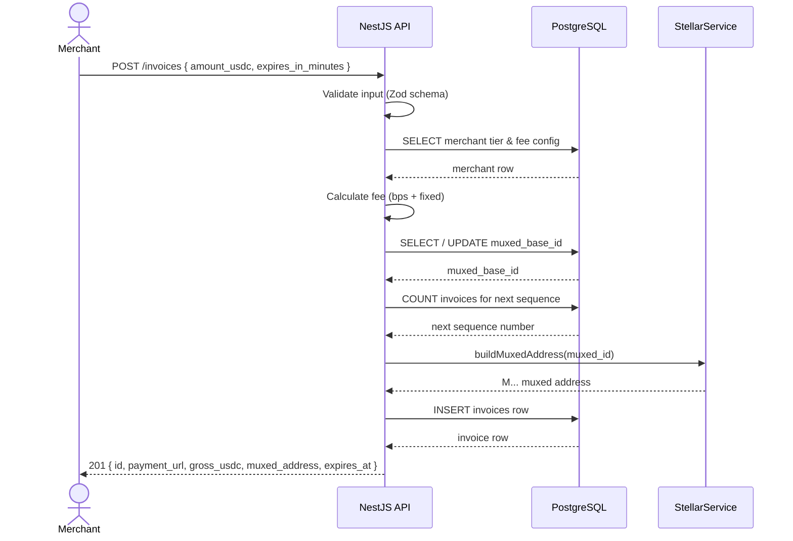
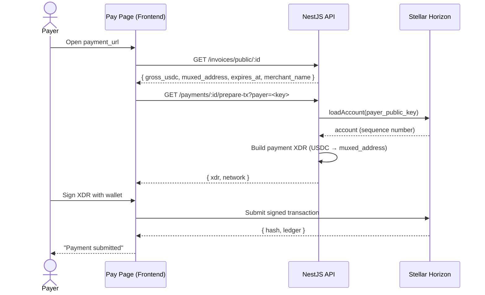
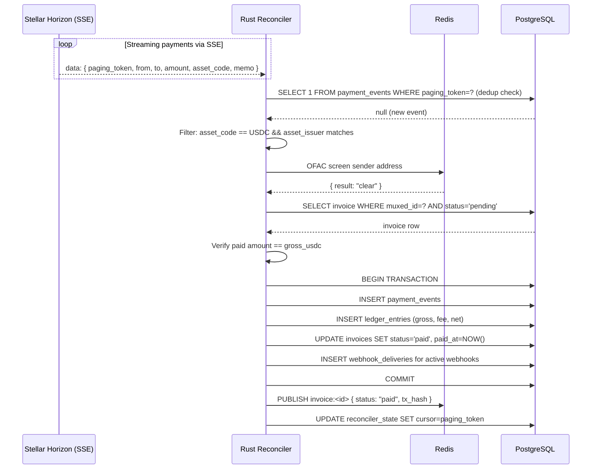
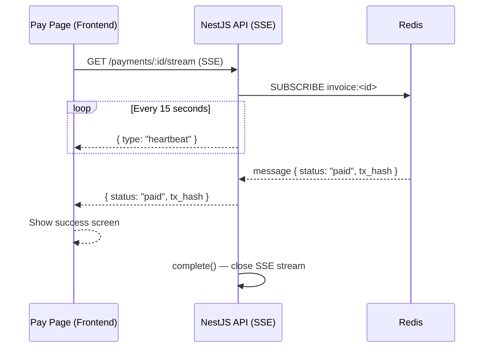
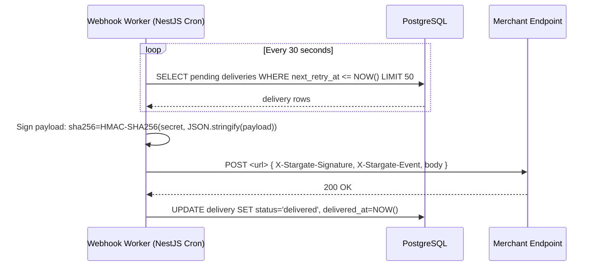
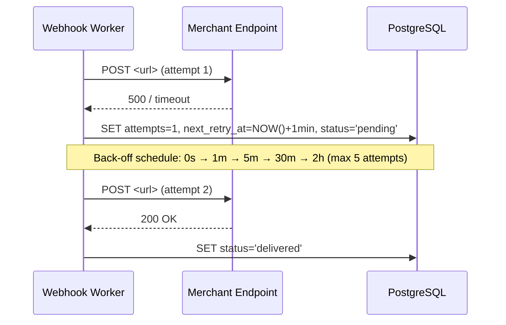
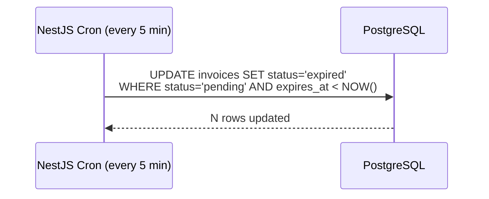
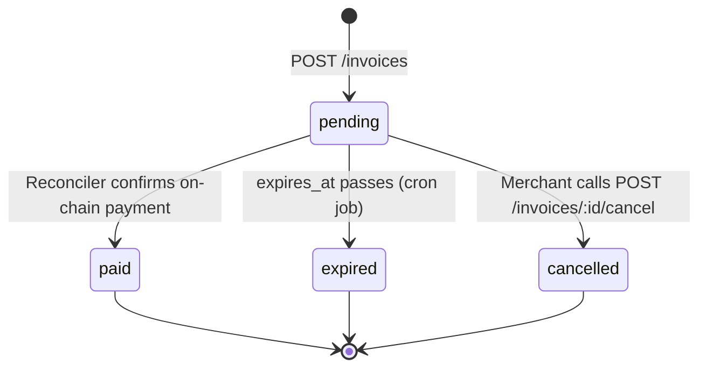

# Invoice Payment Flow

Full lifecycle of a Stargate invoice from creation to settlement, with Mermaid sequence diagrams.

---

## 1. Invoice Creation

---

## 2. Payer Fetches Details and Submits Transaction

---

## 3. Reconciler Detects and Processes the Payment

---

## 4. Real-Time Status Stream (SSE)

---

## 5. Webhook Delivery

---

## 6. Webhook Retry on Failure

---

## 7. Invoice Expiry

---

## 8. Invoice State Machine

---

## Summary Table

| Step | Component  | Action                                                   |
| ---- | ---------- | -------------------------------------------------------- |
| 1    | API        | Creates invoice with muxed address and fee calculation   |
| 2    | Frontend   | Fetches invoice details, builds unsigned XDR             |
| 3    | Payer      | Signs and submits transaction to Stellar                 |
| 4    | Reconciler | Streams Horizon SSE, matches payment to invoice          |
| 5    | Reconciler | Writes ledger entry, marks invoice paid, queues webhook  |
| 6    | Worker     | Delivers webhook with HMAC signature, retries on failure |
| 7    | Cron       | Expires unpaid invoices every 5 minutes                  |
